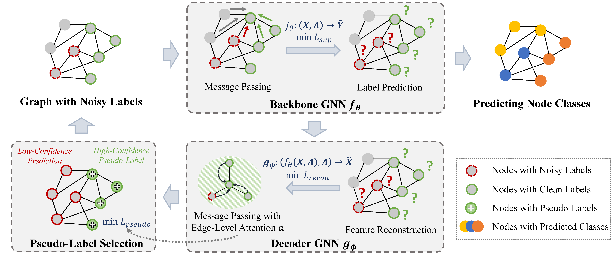

------

# Topological Feature Reconstruction (TFR)

Official code for Paper "Learning from Graph: Mitigating Label Noise on Graph through Topological Feature Reconstruction".
We implemented TFR using the framework provided by [NoisyGL](https://proceedings.neurips.cc/paper_files/paper/2024/hash/436ffa18e7e17be336fd884f8ebb5748-Abstract-Datasets_and_Benchmarks_Track.html). 
You can find implementations and config file of most baseline methods in [this repository](https://github.com/eaglelab-zju/NoisyGL).

## TFR Workflow

TFR is a simple, effective and theoretically guaranteed model for robust graph learning under label noise. 
Its core mechanism leverages a decoder GNN to reconstruct topological features, which regularizes the backbone model against overfitting to noisy labels. 
The reconstruction process also enables the reliable selection of high-confidence pseudo-labels, which provide additional supervision signals beyond noisy labels. 
The overall workflow of TFR is shown below:




## Installation
**Note:** These codes built upon [PyTorch](https://pytorch.org/), [PyTorch Geometric](https://pytorch-geometric.readthedocs.io/en/latest/install/installation.html), [PyTorch Sparse](https://github.com/rusty1s/pytorch_sparse) and [PyTorch Cluster](https://github.com/rusty1s/pytorch_cluster). 
Please install them from the above links. Also, please make sure that you have installed the following dependencies.

## Required Dependencies:
- Python 3.11+
- torch>=2.1.0
- pyg>=2.5.0
- torch_sparse>=0.6.18
- torch_cluster>=1.6.2
- pandas
- scipy
- scikit-learn
- ruamel 
- ruamel.yaml
- nni
- matplotlib
- numpy
- xlsxwriter

## Quick Start
###  Run comprehensive benchmark.
``` bash
python total_exp.py --runs 10 --methods tfr_gcn --datasets dblp --noise_type clean uniform --noise_rate 0.1 0.2 --device cuda:0 --seed 3000
```
By running the command above, "TFR+GCN" will be tested 
on dblp dataset under different types and rates of label noise.
Each experiment will run 10 times and the total results will be saved at ./log and named by the current timestamp.
You can customize the combination of method, data, noise type, and noise rate by changing the corresponding arguments.

###  Run single experiment.
``` bash
python single_exp.py --method tfr_gcn --data dblp --noise_type uniform --noise_rate 0.1 --device cuda:0 --seed 3000
```
This command runs a single experiment in debug mode and is usually used for debugging. 
By running this, detailed experiment information will be printed on the terminal, which can be used to locate the problem.

**Method available** :
`tfr_gcn`, `tfr_gin`, `tfr_sage` 

**Dataset available** :
 `dblp`, `blogcatalog`, `flickr`,  `roman-empire`, `ogbn-arxiv`, 

**noise type** ： 
`clean`, `pair`, `uniform`, `instance_dependent`

## Citation
If our work could help your research, please cite: [Learning from Graph: Mitigating Label Noise on Graph through Topological Feature Reconstruction](https://dl.acm.org/doi/10.1145/3746252.3761185) 

```
@inproceedings{10.1145/3746252.3761185,
author = {Wang, Zhonghao and Bei, Yuanchen and Zhou, Sheng and Zhou, Zhiyao and Fan, Jiapei and Xue, Hui and Wang, Haishuai and Bu, Jiajun},
title = {Learning from Graph: Mitigating Label Noise on Graph through Topological Feature Reconstruction},
year = {2025},
isbn = {9798400720406},
publisher = {Association for Computing Machinery},
address = {New York, NY, USA},
url = {https://doi.org/10.1145/3746252.3761185},
doi = {10.1145/3746252.3761185},
booktitle = {Proceedings of the 34th ACM International Conference on Information and Knowledge Management},
pages = {3261–3270},
numpages = {10},
keywords = {graph neural networks, graph reconstruction, label noise, semi-supervised learning},
location = {Seoul, Republic of Korea},
series = {CIKM '25}
}
```
:star: We’d also be delighted if you could give our repo a star! :blush:


